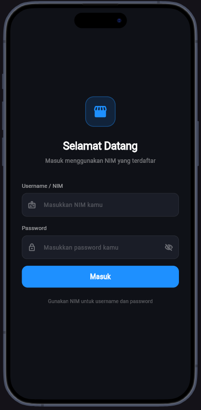
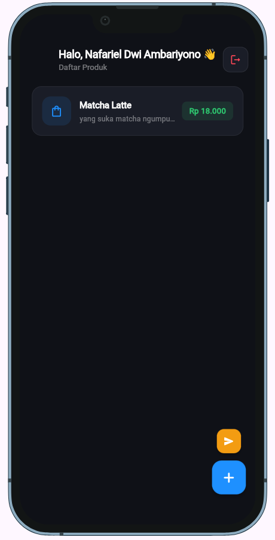
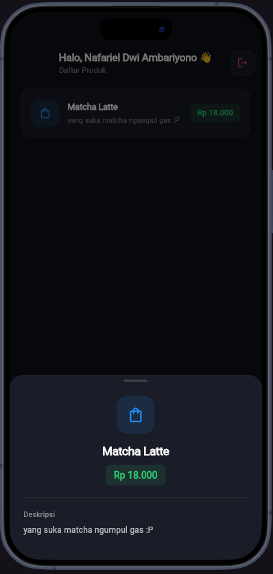
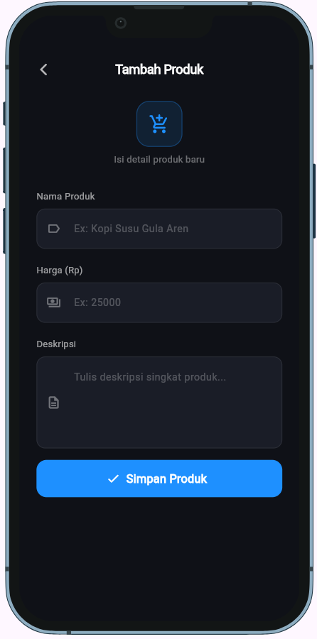
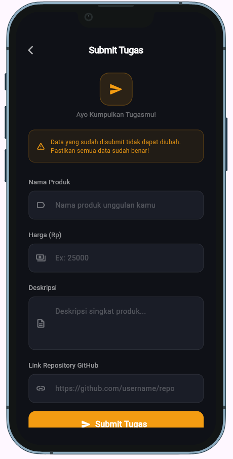

# Tugas PBM API

Aplikasi Flutter untuk tugas praktikum Pemrograman Berbasis Mobile 2026. Aplikasi ini terhubung ke REST API untuk manajemen produk dengan sistem autentikasi berbasis token.

## Identitas

| | |
|---|---|
| Nama | Nafariel Dwi Ambariyono |
| NIM | 242410102071 |

## Fitur

- Login menggunakan NIM sebagai username dan password
- Menyimpan token autentikasi secara aman menggunakan `flutter_secure_storage`
- Menampilkan daftar produk milik akun sendiri
- Menambahkan produk baru ke dalam katalog
- Submit tugas beserta link repository GitHub
- Logout dengan konfirmasi

## Struktur Project

```
lib/
├── main.dart
├── model/
│   └── product_model.dart
├── page/
│   ├── login.dart
│   ├── product_list.dart
│   ├── add_product.dart
│   └── submit_page.dart
└── service/
    └── api_service.dart
```

## Teknologi

- Flutter
- Dart
- REST API — `https://task.itprojects.web.id`
- Package `http` untuk HTTP request
- Package `flutter_secure_storage` untuk menyimpan token
- Package `device_preview` untuk preview tampilan

## Cara Menjalankan

1. Clone repository ini
2. Jalankan perintah berikut di terminal

```bash
flutter pub get
flutter run
```

3. Login menggunakan NIM masing-masing sebagai username dan password

## Tampilan Aplikasi

<p align="center">
  
  
</p>

<p align="center">
  
  
  
</p>